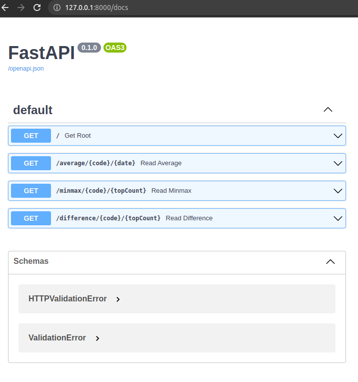

# FastApi with NBP api

## Description

A simple API build using FastApi. Provides example ednpoints for querying average exchange rates from the public Web API
provided by the [NBP](http://api.nbp.pl/en.html)

## Quickstart

### Run the app in containers

* Clone the repo and navigate to the root folder.

* To run the app using Docker, make sure you've got [Docker](https://www.docker.com/) installed on your
  system. From the project's root directory, run:

    ```bash
    docker-compose up
    ```

**Important:**

Read
about [differences between Compose V1 and Compose V2](https://docs.docker.com/compose/compose-v2/#differences-between-compose-v1-and-compose-v2)

### Or, run the app locally

If you want to run the app locally, without using Docker, then:

* Clone the repo and navigate to the root folder.

* Create a virtual environment. Here I'm using Python's built-in venv in a Unix system.
  Run:

    ```bash
    python3.11 -m venv .venv
    ```

* Activate the environment. Run:

    ```bash
    source .venv/bin/activate
    ```


* Install the dependencies. Run:

    ```bash
    pip install -r requirements.txt
    ```

* Start the app. Run:

    ```bash
    uvicorn app.main:app --reload
    ```

## Check it

Open your browser at http://127.0.0.1:8000/

You will see the JSON response as:

`{"message":"Great, it works. Now you can check our endpoints."}`

## Interactive API docs

Now go to http://127.0.0.1:8000/docs.

You will see the automatic interactive API documentation (provided by Swagger UI):


